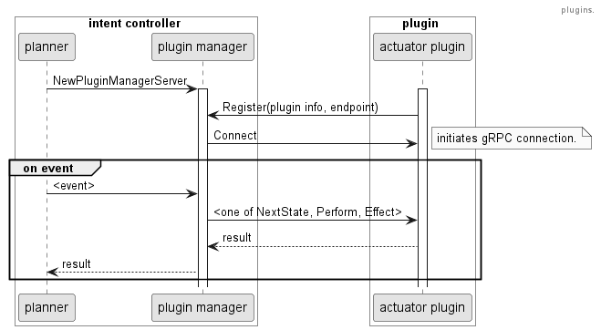

# Plugin Extensions

The initial framework comes with a predefined set of actuators and the A* Planner. In some cases, administrators might
want to use another set of actuators which can enable various orchestration activities. Similarly, different planning
algorithm or multiple planners for several groups of workloads can be supported. Therefore, the overall framework
supports a concept of plugins.

## Actuator Plugins

The current framework supports hot-pluggable actuators. The Intent Controller implements a component responsible for
the overall plugin management. The plugin manager exposes an endpoint that can be used by the available plugins.

As shown in the following diagram, new plugins have to register against this endpoint to be used in the actual planning
cycle:

After successful registration, the planner will call the functions **_NextState_**, **_Perform_** and **_Effect_** via
[gRPC](https://grpc.io/).

## Implementing new plugins

To implement a new actuator plugin, the developer needs to follow these steps:

  1. Implement the new Actuator callbacks (NextState, Perform and Effect).
  2. Create a plugin stub by calling **_plugins.NewActuatorPluginStub_**.
  3. Set actuator callbacks for the stub.
  4. Start the Plugin server (listens for actuator gRPC calls).
  5. Register with the plugin-manager.
  6. Wait for termination.
  7. Stop the plugin stub.

Skeleton code for an actuator plugin can hence look like this:

    package main

    import (
        "os"
	    "os/signal"

        plugins "github.com/intel/intent-driven-orchestrationpkg/api/plugins/v1alpha1"
        "github.com/intel/intent-driven-orchestration/pkg/common"
        "github.com/intel/intent-driven-orchestration/pkg/controller"
        "github.com/intel/intent-driven-orchestration/pkg/planner"
        "github.com/intel/intent-driven-orchestration/pkg/planner/actuators"
        "k8s.io/klog/v2"
        ...
    )

    func NextState(state *common.State, goal *common.State, profiles map[string]common.Profile)
        ([] common.State, []float64, []planner.Action) {
        klog.V(1).InfoS("Invoked NextState() callback")
        return ...
    }

    func Perform(state *common.State, plan []planner.Action) {
        klog.V(1).InfoS("Invoked Perform() callback")
        return ...
    }

    func (s *RmpodPluginHandler) Effect(state *common.State, profiles map[string]common.Profile) {
        klog.V(1).InfoS("Invoked Effect() callback")
        return ...
    }

    func main() {
	    klog.InitFlags(nil)
        ...
	    stub := plugins.NewActuatorPluginStub("plugin name", "plugin endpoint", some-port, "plugin-manager-service", 33333)
        stub.SetNextStateFunc(NextState)
        stub.SetPerformFunc(Perform)
        stub.SetEffectFunc(Effect)
        err = stub.Start()
        if err != nil {
            klog.Fatalf("Error starting plugin server: %s", err)
        }
        err = stub.Register()
        if err != nil {
            klog.Fatalf("Error registering plugin: %s", err)
        }
        signalChan := make(chan os.Signal, 1)
        signal.Notify(signalChan, os.Interrupt)
        <-signalChan
        err = stub.Stop()
        if err != nil {
            klog.Fatalf("Error stopping plugin server: %s", err)
        }
    }

Example usage in the current set of supported plugins can be found in the plugins folder under the root directory of the
repository.
